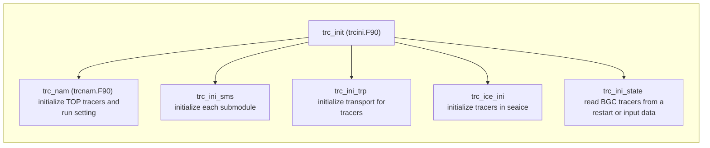
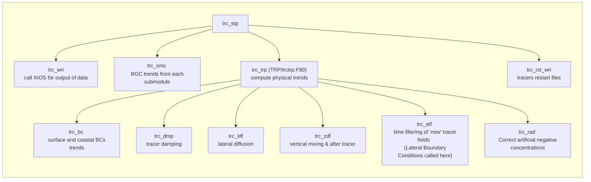

# Create workflow using Mermaid

### Initialization procedure (called by OCE/nemogcm.F90)

```mermaid
graph LR
  subgraph " "
  trc_init["trc_init (trcini.F90)"] --> trc_nam["trc_nam (trcnam.F90) <br> initialize TOP tracers and run setting"]
  trc_init --> trc_ini_sms["trc_ini_sms <br> initialize each submodule"]
  trc_init --> trc_ini_trp["trc_ini_trp <br> initialize transport for tracers"]
  trc_init --> trc_ice_ini["trc_ice_ini <br> initialize tracers in seaice "]
  trc_init --> trc_ini_state["trc_ini_state <br> read BGC tracers from a restart or input data"]
end
```

### Time marching procedure (called by OCE/stp.F90)

```mermaid
graph LR
  subgraph " "
  trc_stp --> trc_wri["trc_wri <br> call XIOS for output of data"]
  trc_stp --> trc_sms["trc_sms <br> BGC trends from each submodule"]
  trc_stp --> trc_trp["trc_trp (TRP/trctrp.F90)<br> compute physical trends"]
  trc_trp --> trc_bc["trc_bc <br> surface and coastal BCs trends"]
  trc_trp --> trc_dmp["trc_dmp <br> tracer damping"]
  trc_trp --> trc_ldf["trc_ldf <br> lateral diffusion"]
  trc_trp --> trc_zdf["trc_zdf <br> vertical mixing & after tracer"]
  trc_trp --> trc_nxt["trc_atf <br> time filtering of 'now' tracer fields  <br> (Lateral Boundary Conditions called here)"]
  trc_trp --> trc_rad["trc_rad <br> Correct artificial negative concentrations"]
  trc_stp --> trc_rst_wri["trc_rst_wri <br> tracers restart files"]
end
```
